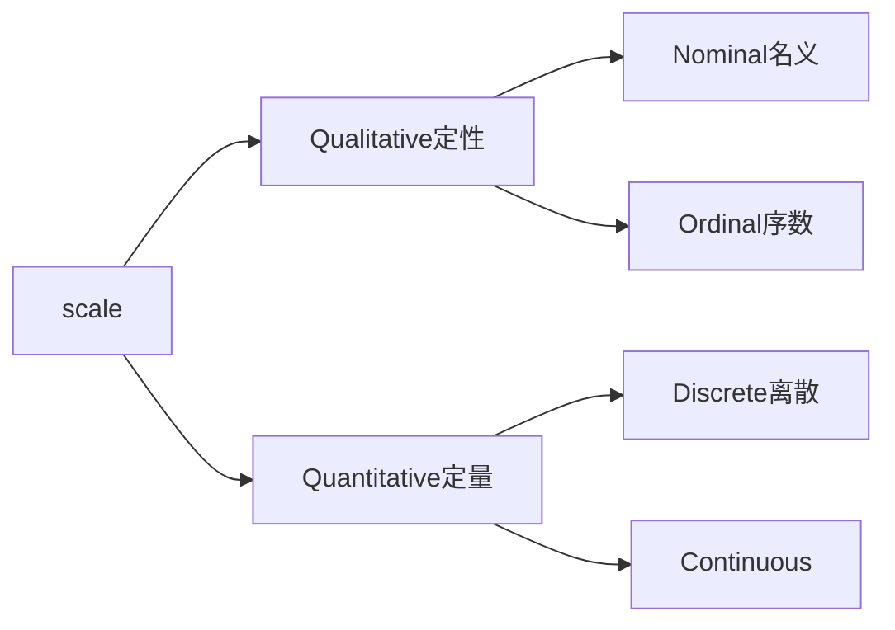
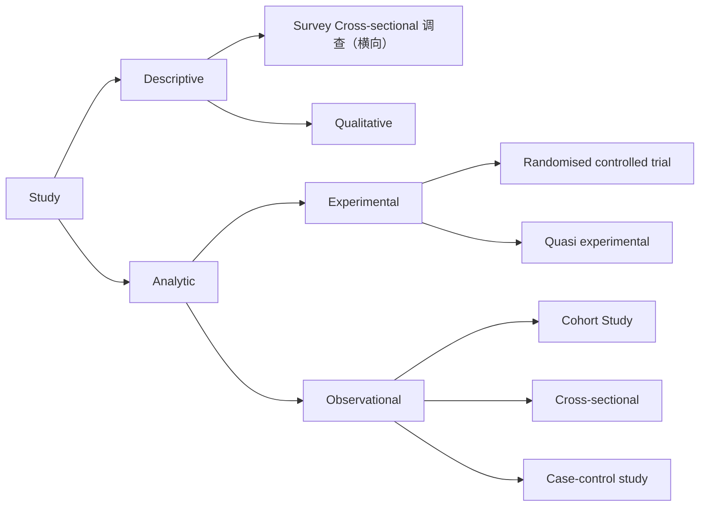

refers to facts and statistics collected together for reference or analysis.

## Primary data
- Information collected directly from source
- Data collected for very 1st time
- Data is original and specific to your research
## Secondary data
- Data collected by someone else (Often the primary data)
- Data collected in the past
- Data is NOT original or 1st hand data

Example:
> A marketing agency utilizes sales reports and customer feedback from a retail store to analyze market trends for a newproductlaunch. 营销机构利用零售店的销售报告和客户反馈来分析新产品发布的市场趋势。
> : Secondary data
> A research team conducts surveys and interviews with patients to gather information about the effectiveness of a new drug. 研究小组对患者进行调查和访谈，以收集有关新药有效性的信息。
> : Primary data

## Categories of Data

### Nominal Data
This type of data is qualitative in nature which has no inherent mathematical significance. It is sort of a fixed value under which a unit of observation is assigned or “categorized”.
这种类型的数据本质上是定性的，没有内在的数学意义。它是一种固定值，观察单位根据该值被分配或“分类”。

特殊类型：Binary variables 二元分类
### Ordinal Data
This type of data is the combination of numerical and categorical data, i.s. categorical data having some mathematical significance.
这类数据是数值数据和分类数据的结合，即分类数据具有一定的数学意义。
### Discrete Data
Discrete data is the information that often counts of some event, i.e. can only take specific values. These are often integer-based, but not necessarily.
离散数据是某些事件的常见计数信息，即只能取特定值。这些通常基于整数，但不一定。
eg:
- Number of times a coin was flipped
- Shoe sizes of people
### Continuous Data
Continuous Data is the information that has the possibility of having infinite values, i.e. can take any value within a range.
连续数据是可能具有无限值的信息，即可在一定范围内取任意值。
eg:
- How many centimeters of rain fell on a given day
- Distance, volume

## Level of Measurement
It is important, as it determines the type of statistical analysis you can carry out.
### Nominal
Nominal variables are used to “name” a series of values. 

eg:
- eye color(Blue, Brown, Green)
- smartphone(iPhone, Huawei, Samsung)
How to analyzed:
- Descriptive statistics: Frequency distribution and mode
- Non-parametric: statistical tests
### Ordinal
Ordinal scales provide good information about the order of choices.

eg:
- school grades(A, B, C)
- edu level(Bachelor, Master, PhD)
How to analyzed:
- Descriptive statistics: Frequency distribution, mode, median and range
- Non-parametric: statistical tests
### Interval
Interval scales give us the order of values and the ability to quantify the difference between each one. **Interval data has equal intervals between adjacent values.**

eg:
- temperature
- IQ score
- Income ranges
How to analyzed:
- Descriptive statistics: Frequency distribution, mode, median and mean; range, standard deviation and variance
- Parametric statistical tests (t-test, linear regression)
### Ratio
Ratio scales give us the ultimate–order, interval values, plus the ability to calculate ratios since a “true zero” can be defined. **Ratio data has equal distances between adjacent values and a true zero.**

eg:
- weight in KG
- number of staff
- income in USD
How to analyzed:
- Descriptive statistics: Frequency distribution, mode, median and mean; range, standard deviation, variance, and coefficient of variation
- Parametric statistical tests (ANOVA, linear regression)

## Study Design

