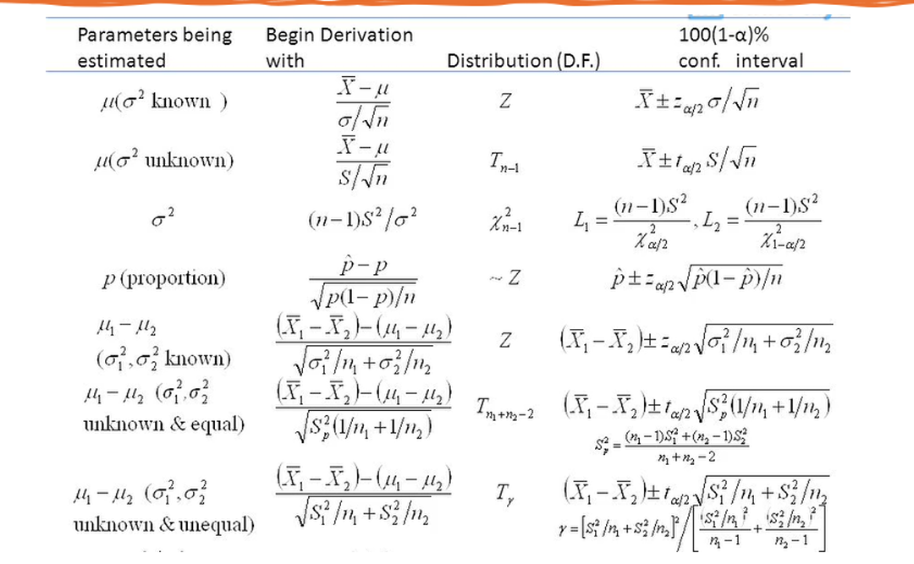

# 参数估计

## 点估计

Point estimation is a single value (or point) used to approximate a population parameter. 点估计是用来近似总体参数的单个值（或点）。

### Properties of Estimator (估计量的性质)

- $X$: random variable
- $\theta$: parameter of interest, unknown

$$
X_1, X_2, \cdots, X_n \sim f(x; \theta)
$$

- $\hat{\theta} = \theta(X_1, X_2, \cdots, X_n)$: estimator of $\theta$
- Previously, we found good(?) estimator(s) for $\theta$ or $\theta$'s function(s) using method of moments, maximum likelihood, etc.

**Goal**
- Check how good are the estimators, or are they good at all?
- If more than one good estimator is available, which one is better?

### Unbiased Estimator (无偏估计)

$\hat{\theta}$ is an unbiased estimator of $\theta$ for all $\theta$ if

$$
E(\hat{\theta}) = \theta \quad \text{for all } \theta \in \Theta
$$

Otherwise, $\hat{\theta}$ is biased.  $bias(\hat{\theta}) = E(\hat{\theta}) - \theta$

> $\hat{\theta}$ unbiased $\Leftrightarrow$ $b(\hat{\theta}) = 0$

### Consistent Estimator (一致估计)

$\hat{\theta}$ is a consistent estimator for parameter $\theta$ for all $\theta$ if

$$
\hat{\theta} \overset{p}{\rightarrow} \theta
$$

$$
P\left| \hat{\theta} - \theta \right| \geq \varepsilon \rightarrow 0 \quad \text{as } n \rightarrow \infty
$$

For large n, a consistent estimator tends to be closer to  the unknown population parameter. 对于较大的 n，一致性估计量往往更接近未知的总体参数。

### Efficiency (有效性)

An Efficient Estimator tends to fall closer to $\theta$, on the average, than other estimators. 与其他估计量相比，有效估计量平均倾向于更接近 $\theta$。

MSE (Mean Squared Error): 

$$
MSE(\hat{\theta}) = {E\left[ \hat{\theta} - \theta \right]}^2
    = var(\hat{\theta}) + {\left[ E(\hat{\theta}) - \theta \right]}^2
    = var(\hat{\theta}) + bias^2(\hat{\theta})
$$

For unbiased estimator, $MSE(\hat{\theta}) = var(\hat{\theta})$

The best one with smallest MSE is a minimum variance unbiased estimator. 具有最小 MSE 的最佳估计量是最小方差无偏估计量。

### Maximum Likelihood Estimator (MLE) (最大似然估计)

Given a random sample $X_1, X_2, \cdots, X_n$ from a population with pdf $f(x; \theta)$, the likelihood function is

$$
L(\theta) = \prod_{i=1}^{n} f(x_i; \theta)
$$

The MLE of $\theta$ is the value of $\theta$ that maximizes $L(\theta)$.

## 区间估计

Interval estimation is an interval of numbers around the point estimate used to approximate a population parameter.  区间估计是用来近似总体参数的点估计周围的一段数字区间。

### Confidence Interval (置信区间)

Confidence interval is a range within which the true parameter value is believed to lie with a specified degree of confidence. 置信区间是一个范围，其中真实参数值被认为具有指定的置信度。

- An interval estimate consists of a range of  values with an upper & lower limit. 区间估计由一个具有上限和下限的值范围组成。
- The population parameter is expected to lie within with a certain level of confidence. 总体参数预计将在一定的置信水平内。

$$
CI = \bar{x} \pm ME
$$

where $\bar{x}$ is the point estimate and $ME$ is the margin of error.

### Confidence Level (置信水平)

The confidence level is the probability that the interval estimate will contain the population parameter, assuming that the estimation process is repeated a large number of times. 置信水平是区间估计将包含总体参数的概率，假设估计过程重复多次。

- (1 - $\alpha$) is the confidence level
- $\alpha$ is the significance level
- The range between the lower and upper limits is the confidence interval. 介于下限和上限之间的范围是置信区间。

### Critical Value (临界值)

Critical Value is the value of the test statistic which defines the upper and lower bounds of a confidence interval. 临界值是定义置信区间的上限和下限的检验统计量的值。

Let $z_{\alpha}$ denote the standard normal quantile for righttail probability equal to $\alpha$. 让 $z_{\alpha}$ 表示右尾概率等于 $\alpha$ 的标准正态量。

Then critical values = $\pm z_{\alpha/2}$

### Margin of Error (误差边界)

Margin of Error denoted by E, is the maximum likely difference (with probability 1 – $\alpha$ , such as 0.95) between the observed estimate and the true population parameter. It can be found by multiplying the critical value and the standard error. 误差边界 E 是观察估计值和真实总体参数之间的最大可能差异（概率为 1 - $\alpha$，例如 0.95）。可以通过将临界值与标准误差相乘来找到。

$$
ME = z_{\alpha/2} \times SE
$$

## One-Sample Confidence Interval (单样本置信区间)

### Mean of a Population (总体均值的置信区间)

| Distribution | Sample Size | $\sigma$ Known                                           | $\sigma$ Unknown                                        |
|--------------|-------------|----------------------------------------------------------|---------------------------------------------------------|
| Normal       | Large       | $\bar{x} \pm z_{\alpha/2} \cdot \frac{\sigma}{\sqrt{n}}$ | $\bar{x} \pm z_{\alpha/2} \cdot \frac{s}{\sqrt{n}}$     |
| Normal       | Small       | $\bar{x} \pm z_{\alpha/2} \cdot \frac{\sigma}{\sqrt{n}}$ | $\bar{x} \pm t_{\alpha/2, df} \cdot \frac{s}{\sqrt{n}}$ |
| Non-Normal   | Large       | $\bar{x} \pm z_{\alpha/2} \cdot \frac{\sigma}{\sqrt{n}}$ | $\bar{x} \pm z_{\alpha/2} \cdot \frac{s}{\sqrt{n}}$     |
- $\bar{x}$: sample mean
- $\sigma$: population standard deviation
- $s$: sample standard deviation
- $df$: degrees of freedom, $df = n - 1$

### Proportion of a Population (总体比例的置信区间)

$$
CI = \hat{p} \pm z_{\alpha/2} \cdot \sqrt{\frac{\hat{p}(1-\hat{p})}{n}}
$$

- $\hat{p}$: sample proportion

### Variance of a Population (总体方差的置信区间)

Variances of a population can be estimated using the chi-square distribution. 总体方差可以使用卡方分布进行估计。

$$
CI = \left[ \frac{(n-1)s^2}{\chi^2_{\alpha/2, n-1}}, \frac{(n-1)s^2}{\chi^2_{1-\alpha/2, n-1}} \right]
$$

- $s^2$: sample variance

## Two-Sample Confidence Interval (双样本置信区间)

### Difference Between Two Means (两个总体均值之差的置信区间)

#### Independent Samples (独立样本)

- Large Sample, Known $\sigma_1$ and $\sigma_2$:

$$
z = \frac{(\bar{x}_1 - \bar{x}_2) - (\mu_1 - \mu_2)}{\sqrt{\frac{\sigma_1^2}{n_1} + \frac{\sigma_2^2}{n_2}}} \sim N(0, 1)
\quad,
CI = (\bar{x}_1 - \bar{x}_2) \pm z_{\alpha/2} \cdot \sqrt{\frac{\sigma_1^2}{n_1} + \frac{\sigma_2^2}{n_2}}
$$

- Large Sample, Unknown $\sigma_1$ and $\sigma_2$:

$$
CI = (\bar{x}_1 - \bar{x}_2) \pm z_{\alpha/2} \cdot \sqrt{\frac{s_1^2}{n_1} + \frac{s_2^2}{n_2}}
$$

- Small Sample
  - Assumption: 1. Normality, 2. Two random samples are drawn independently from two populations.
  - Unknown $\sigma_1$ and $\sigma_2$ (equal):

$$
{s_p}^2 = \frac{(n_1 - 1)s_1^2 + (n_2 - 1)s_2^2}{n_1 + n_2 - 2}, df = n_1 + n_2 - 2
$$

$$
t = \frac{(\bar{x}_1 - \bar{x}_2) - (\mu_1 - \mu_2)}{s_p \cdot \sqrt{\frac{1}{n_1} + \frac{1}{n_2}}} \sim t(df)
\quad,
CI = (\bar{x}_1 - \bar{x}_2) \pm t_{\alpha/2, df} \cdot s_p \cdot \sqrt{\frac{1}{n_1} + \frac{1}{n_2}}
$$

  - Unknown $\sigma_1$ and $\sigma_2$ (not equal):

$$
df = \frac{\left( \frac{s_1^2}{n_1} + \frac{s_2^2}{n_2} \right)^2}{\frac{{(s_1^2/n_1)}^2}{n_1 - 1} + \frac{{(s_2^2/n_2)}^2}{n_2 - 1}}
\quad,
CI = (\bar{x}_1 - \bar{x}_2) \pm t_{\alpha/2, df} \cdot \sqrt{\frac{s_1^2}{n_1} + \frac{s_2^2}{n_2}}
$$

#### Paired Samples (配对样本)

| $\sigma_d$ Known                                           | $\sigma_d$ Unknown                                        |
|------------------------------------------------------------|-----------------------------------------------------------|
| $\bar{d} \pm z_{\alpha/2} \cdot \frac{\sigma_d}{\sqrt{n}}$ | $\bar{d} \pm t_{\alpha/2, df} \cdot \frac{s_d}{\sqrt{n}}$ |
- $\mu_d$: population mean of differences ($\mu_d = \mu_1 - \mu_2$)
- $\bar{d}$: sample mean of differences
- $\sigma_d$: population standard deviation of differences
- $s_d$: sample standard deviation of differences

$$
\bar{d} = \frac{1}{n} \sum_{i=1}^{n} d_i
\quad,
s_d = \sqrt{\frac{1}{n-1} \sum_{i=1}^{n} (d_i - \bar{d})^2}
$$

### Difference Between Two Proportions (两个总体比例之差的置信区间)

$$
Z = \frac{(\hat{p}_1 - \hat{p}_2) - (p_1 - p_2)}{\sqrt{\frac{p_1(1-p_1)}{n_1} + \frac{p_2(1-p_2)}{n_2}}} \sim N(0, 1)
\quad,
CI = (\hat{p}_1 - \hat{p}_2) \pm z_{\alpha/2} \cdot \sqrt{\frac{\hat{p}_1(1-\hat{p}_1)}{n_1} + \frac{\hat{p}_2(1-\hat{p}_2)}{n_2}}
$$

### The Ratio of Two Variances (两个总体方差之比的置信区间)

The ratio of two sample variances follows an F-distribution. 两个样本方差的比值遵循 F 分布。

$$
df_1 = n_1 - 1, df_2 = n_2 - 1
\quad,
CI = \left[ \frac{s_1^2 / s_2^2}{F_{\alpha/2}}, \frac{s_1^2 / s_2^2}{F_{1-\alpha/2}} \right]
$$

$$
F_{1-\alpha/2}(df_1, df_2) = \frac{1}{F_{\alpha/2}(df_2, df_1)}
$$

## Determination of Sample Size (样本量的确定)

- Mean of a Population (总体均值): $n = \lceil \left( \frac{z_{\alpha/2} \cdot \sigma}{E} \right)^2 \rceil \quad \text{or} \quad n = \lceil \left( \frac{t_{\alpha/2} \cdot s}{E} \right)^2 \rceil$
- Proportion of a Population (总体比例): $n = \lceil \left( \frac{z_{\alpha/2} \cdot \sqrt{p(1-p)}}{E} \right)^2 \rceil$

## Summary
