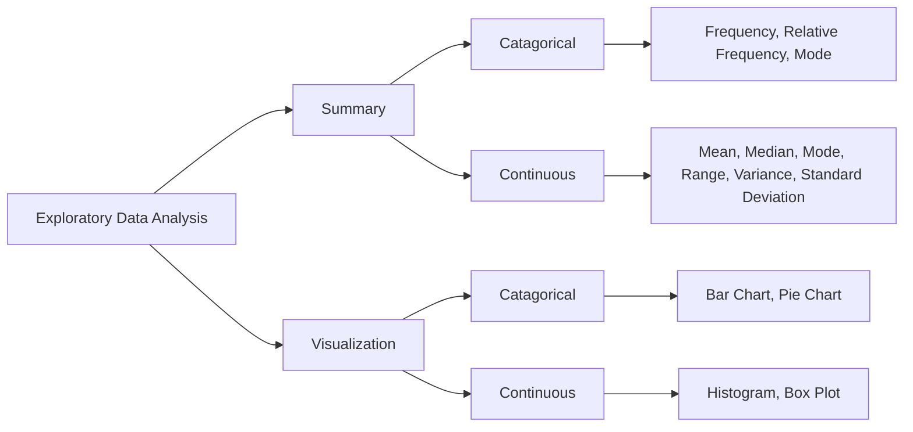

# Analysis

(Mean: 平均值, Median: 中位数, Mode: 众数, Range: 范围, Variance: 方差, Standard Deviation: 标准差)

## 常见表图

- Scatter Plot 散点图
- Bar Chart 柱状图
- Line Chart 折线图
- Pie Chart 饼图
- Histogram 直方图
- Box Plot 箱线图
- Density Plot 密度图
- QQ Plot(Quantile-Quantile Plot) QQ图(分位数图)

### Box Plot

- Q1：第一四分位数，即将数据从小到大排列后，处于25%位置的数值
- Q3：第三四分位数，即将数据从小到大排列后，处于75%位置的数值

IQR计算公式：IQR = Q3 - Q1

Outlier的判定标准：小于Q1 - 1.5 * IQR 或 大于Q3 + 1.5 * IQR

### Skewness

- Symmetric 对称分布: Mean = Median = Mode
- Right/Positively Skewed 右偏分布: Mode < Median < Mean (数据集中在左侧)
- Left/ Negatively Skewed 左偏分布: Mean < Median < Mode (数据集中在右侧)

## Correlation

### Continuous Variables

Pearson Correlation Coefficient 皮尔逊相关系数: -1 <= r <= 1

$$
r = \frac{\sum_{i=1}^{n} (x_i - \bar{x})(y_i - \bar{y})}{\sqrt{\sum_{i=1}^{n} (x_i - \bar{x})^2} \cdot \sqrt{\sum_{i=1}^{n} (y_i - \bar{y})^2}}
  = \frac{Cov(X, Y)}{\sigma_X \cdot \sigma_Y} = \frac{S_{xy}}{\sqrt{S_{xx} \cdot S_{yy}}}
$$
$$
S_{xy} = \sum_{i=1}^{n} (x_i - \bar{x})(y_i - \bar{y}) = \sum_{i=1}^{n} x_i \cdot y_i - \frac{1}{n} \sum_{i=1}^{n} x_i \cdot \sum_{i=1}^{n} y_i
$$
$$
S_{xx} = \sum_{i=1}^{n} (x_i - \bar{x})^2 = \sum_{i=1}^{n} x_i^2 - \frac{1}{n} (\sum_{i=1}^{n} x_i)^2
$$
$$
S_{yy} = \sum_{i=1}^{n} (y_i - \bar{y})^2 = \sum_{i=1}^{n} y_i^2 - \frac{1}{n} (\sum_{i=1}^{n} y_i)^2
$$

### Ordinal Variables

Spearman Correlation Coefficient 斯皮尔曼相关系数: -1 <= r <= 1

$$

r_s = 1 - \frac{6 \sum_{i=1}^{n} d_i^2}{n(n^2 - 1)}

$$

> $d_i$ 是两个变量的秩次差

e.g.

| X  | Rank(X) | Y  | Rank(Y) | $d_i$  | $d_i^2$ |
|----|---------|----|---------|--- ----|---------|
| 35 |  2      | 30 |   4     |  -2    |  4      |
| 23 |  3      | 33 |   3     |   0    |  0      |
| 47 |  1      | 45 |   2     |  -1    |  1      |
| 17 |  4      | 23 |   5     |  -1    |  1      |
| 10 |  5      | 49 |   1     |   4    | 16      |

## Distributions

### Discrete Distributions 离散分布

1. 0 <= P(X = k) <= 1
2. $\sum_{k} P(X = k) = 1$

- 二项分布 Binomial Distribution
    $$
    P(X = k) = C(n, k) \cdot p^k \cdot (1 - p)^{n - k}
    $$
- 泊松分布 Poisson Distribution
    $$
    P(X = k) = \frac{\lambda^k \cdot e^{-\lambda}}{k!}
    $$
- 超几何分布 Hypergeometric Distribution
    $$
    P(X = k) = \frac{C(K, k) \cdot C(N - K, n - k)}{C(N, n)}
    $$

### Continuous Distributions 连续分布

1. $P(X = k) = 0$
2. $P(a \leq X \leq b) = \int_{a}^{b} f(x) dx = F(b) - F(a)$
3. $\int_{-\infty}^{+\infty} f(x) dx = 1$
4. $F(x) = \int_{-\infty}^{x} f(t) dt$

- 正态分布 Normal Distribution: 均值$\mu$，方差$\sigma^2$
    $$
    f(x) = \frac{1}{\sigma\sqrt{2\pi}} e^{-\frac{(x - \mu)^2}{2\sigma^2}}
    $$
    $$
    X \sim N(\mu, \sigma^2)
    $$
    $$
    \mu = E(X) = \int_{-\infty}^{+\infty} x \cdot f(x) dx = \sum_{i=1}^{n} x_i \cdot P(X = x_i)
    $$
    $$
    \sigma^2 = E(X - \mu)^2 = E(X^2) - E(X)^2 = \int_{-\infty}^{+\infty} (x - \mu)^2 \cdot f(x) dx
            = \sum_{i=1}^{n} (x_i - \mu)^2 \cdot P(X = x_i) = \sum_{i=1}^{n}({x_i}^2 \cdot P(X = x_i)) - \mu^2
    $$
  - 标准正态分布 Standard Normal Distribution: $\mu = 0, \sigma = 1$
    $$
    Z = \frac{X - \mu}{\sigma} \sim N(0, 1)
    $$
    $$
    P(X \leq x) = P(Z \leq \frac{x - \mu}{\sigma}) = \Phi(\frac{x - \mu}{\sigma})
    $$

### Central Limit Theorem 中心极限定理

When samples are large and measurements independent then many estimators have normal sampling distributions 当样本很大且测量值独立时，许多估计量具有正态抽样分布: 

- Sample Mean: $\bar{X} \sim N(\mu, \frac{\sigma^2}{n})$, $\sigma' = \frac{\sigma}{\sqrt{n}}$
- Sample Proportion: $\hat{p} \sim N(p, \frac{p(1-p)}{n})$, $\sigma' = \sqrt{\frac{p(1-p)}{n}}$, $p$: population proportion

### Normal Distribution Approximation 正态分布近似

Conditions:
1. The sample is a simple random sample of size $n$ from a population in which the proportion of successes is $p$ 该样本是来自总体的大小为 $n$ 的简单随机样本，其中成功比例为 $p$
2. $np \geq 5$ and $n(1-p) \geq 5$

$$
\mu = np, \sigma = \sqrt{np(1-p)}
$$

| Binomial | Normal |
| -------- | ------ |
| $P(X = k)$ | $P(k - 0.5 \leq X \leq k + 0.5)$ |
| $P(X \geq k)$ | $P(X \geq k - 0.5)$ |
| $P(X > k)$ | $P(X > k + 0.5)$ |
| $P(X \leq k)$ | $P(X \leq k + 0.5)$ |
| $P(X < k)$ | $P(X < k - 0.5)$ |
