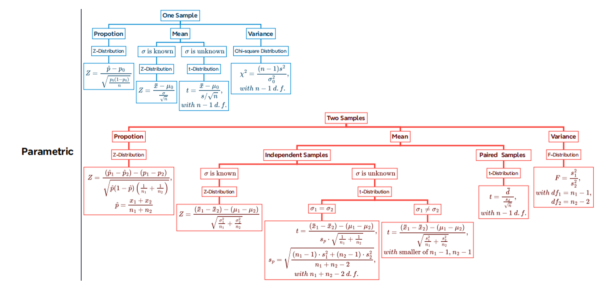

## Forming

Null Hypothesis ($H_0$) is a statement that the value of a population parameter is equal to some claimed value. 原假设是一个关于总体参数的陈述，它的值等于某个特定值。
- MUST contain condition of equality 必须包含等号
- No effect or no difference 没有效果或没有差异
- Symbolic form: $=, \leq, \geq$

Alternative Hypothesis ($H_a$) is the statement that the parameter has a value that differs from the null hypothesis. 备择假设是一个关于总体参数的陈述，它的值不等于原假设的值。
- Hypothetical statement that the researcher wants to test 假设研究者想要检验的陈述
- Symbolic form: $\neq, <, >$

Example:
> A manufacturer claims that the average life of a transistor is less than1000 hours (h)
> - $H_0: \mu \geq 1000$
> - $H_a: \mu < 1000$
>
> A pharmaceutical firm maintains that the average time for a certain drug to take effect is 15 mins 
> - $H_0: \mu = 15$
> - $H_a: \mu \neq 15$
>
> The mean starting salary of graduates is higher than R50000 per annum 
> - $H_0: \mu \leq 50000 \quad\text{or}\quad \mu = 50000$
> - $H_a: \mu > 50000$

## Two Types of Errors

Because your decision is based on a sample, there is the possibility of making the wrong decision. 由于你的决策是基于样本，所以有可能做出错误的决定。
- Type I Error: Rejecting a true null hypothesis 原假设为真，却拒绝了原假设
- Type II Error: Failing to reject a false null hypothesis 原假设为假，却没有拒绝原假设

| Project | Not rejected $H_0$ | Rejected $H_0$ |
| --- | --- | --- |
| $H_0$ is true | 1 - $\alpha$ | $\alpha$ (Type I Error) |
| $H_0$ is false | $\beta$ | 1 - $\beta$ (Power of the test) |

### Level of Significance

Your maximum allowable probability of making a Type I error. 你允许的最大犯第一类错误的概率。($\alpha$)

\[Pre-specified] By setting $\alpha$ at a small value, you are saying that you want the probability of rejecting a true null hypothesis to be small. 通过将 $\alpha$ 设置为一个小值，我们表明我们希望拒绝一个真实的原假设的概率很小。

Commonly used levels of significance are 0.01, 0.05, and 0.10. 通常使用的显著性水平是0.01、0.05和0.10。

## Statistical Tests

| Parameter | Sampling Distribution | Test Statistic |
| --- | --- | --- |
| Proportion: $p$ | Normal | $Z = \frac{\hat{p} - p}{\sqrt{\frac{p(1-p)}{n}}}$ |
| Mean: $\mu$ | Normal | $Z = \frac{\bar{x} - \mu}{\frac{\sigma}{\sqrt{n}}}$ |
| Mean: $\mu$ | t | $t = \frac{\bar{x} - \mu}{\frac{s}{\sqrt{n}}}$ |
| Variance: $\sigma^2$ | Chi-square | $\chi^2 = \frac{(n-1)s^2}{\sigma^2}$ |

### Types of Hypothesis Tests

- Left-tailed test: $H_a: \mu < \mu_0$ => $Z \leq -Z_{\alpha}$ => $p \leq \alpha$
- Right-tailed test: $H_a: \mu > \mu_0$ => $Z \geq Z_{1-\alpha}$ => $p \leq \alpha$
- Two-tailed test: $H_a: \mu \neq \mu_0$ => $\left| Z \right| \geq \left| Z_{1-\alpha/2} \right|$ => $p \leq \alpha/2$

### Conclusions

Critical Value Method:
- Reject $H_0$ if the test statistic falls in the critical region 拒绝 $H_0$ 如果检验统计量落在临界区域内
- Fail to reject $H_0$ if the test statistic falls in the non-critical region 没有拒绝 $H_0$ 如果检验统计量落在非临界区域内

P-value Method:
- Reject $H_0$ if the p-value is less than or equal to the level of significance 拒绝 $H_0$ 如果p值小于或等于显著性水平
- Fail to reject $H_0$ if the p-value is greater than the level of significance 没有拒绝 $H_0$ 如果p值大于显著性水平

1. Reject $H_0$: There is sufficient/enough evidence to conclude ...(whatever $H_a$ states)
2. Fail to reject $H_0$: There is insufficient evidence to conclude ...(whatever $H_a$ states)

## Parametric Hypothesis Tests

Parametric tests are restricted to data that:
1) show a normal distribution 显示正态分布
2) * are independent of one another  样本之间是独立的
3) * are on the same continuous scale of measurement 在相同的连续测量尺度上
### One-sample

test population mean ($\mu$):

| Sample Size         | $\sigma$ Known                                      | $\sigma$ Unknown                               |
| ------------------- | --------------------------------------------------- | ---------------------------------------------- |
| Large ($n \geq 30$) | $Z = \frac{\bar{x} - \mu_0}{\sigma/\sqrt{n}}$         | $Z = \frac{\bar{x} - \mu_0}{s/\sqrt{n}}$         |
| Small ($n < 30$)    | $Z = \frac{\bar{x} - \mu_0}{\sigma/\sqrt{n}}$         | $t = \frac{\bar{x} - \mu_0}{s/\sqrt{n}}$         |

- $\mu_0$: hypothesized population mean 假设的总体均值
- Z compared to $Z_{\alpha}$, t compared to $t_{\alpha, n-1}$

test population proportion ($p$):

$$
Z = \frac{\hat{p} - p_0}{\sqrt{\frac{p_0(1-p_0)}{n}}}
$$

- $p_0$: hypothesized population proportion 假设的总体比例
- Z compared to $Z_{\alpha}$

test population variance ($\sigma^2$):

$$
\chi^2 = \frac{(n-1)s^2}{{\sigma_0}^2}
$$

- $\sigma_0^2$: hypothesized population variance 假设的总体方差
- $\chi^2$ compared to $\chi^2_{\alpha, n-1}$

### Two-sample

test difference between two population means ($\mu_1 - \mu_2$):

- Large Sample, Known $\sigma_1$ and $\sigma_2$:

$$
Z = \frac{(\bar{x}_1 - \bar{x}_2) - (\mu_1 - \mu_2)}{\sqrt{\frac{\sigma_1^2}{n_1} + \frac{\sigma_2^2}{n_2}}} 
$$

- Large Sample, Unknown $\sigma_1$ and $\sigma_2$:

$$
Z = \frac{(\bar{x}_1 - \bar{x}_2) - (\mu_1 - \mu_2)}{\sqrt{\frac{s_1^2}{n_1} + \frac{s_2^2}{n_2}}}
$$

- Small Sample
  - Assumption: 1. Normality, 2. Two random samples are drawn independently from two populations.
  - Unknown $\sigma_1$ and $\sigma_2$ (equal):

$$
{s_p}^2 = \frac{(n_1 - 1)s_1^2 + (n_2 - 1)s_2^2}{n_1 + n_2 - 2}, df = n_1 + n_2 - 2
$$

$$
t = \frac{(\bar{x}_1 - \bar{x}_2) - (\mu_1 - \mu_2)}{s_p \cdot \sqrt{\frac{1}{n_1} + \frac{1}{n_2}}}
$$

  - Unknown $\sigma_1$ and $\sigma_2$ (not equal):

$$
df = \frac{\left( \frac{s_1^2}{n_1} + \frac{s_2^2}{n_2} \right)^2}{\frac{{(s_1^2/n_1)}^2}{n_1 - 1} + \frac{{(s_2^2/n_2)}^2}{n_2 - 1}}
$$

$$
t = \frac{(\bar{x}_1 - \bar{x}_2) - (\mu_1 - \mu_2)}{\sqrt{\frac{s_1^2}{n_1} + \frac{s_2^2}{n_2}}}
$$

- Paired Samples
  - Assumption: $\sigma_1 = \sigma_2$
  - $H_0: \mu_d = 0$
  - $\bar{d}$: sample mean of differences
  - $\sigma_d$: population standard deviation of differences
  - $s_d$: sample standard deviation of differences

$$
t = \frac{\bar{d}}{s_d/\sqrt{n}}
$$

test difference between two population proportions ($p_1 - p_2$):
- Test $p_1-p_2 = 0$

$$
\hat{p} = \frac{x_1 + x_2}{n_1 + n_2} = \frac{n_1 \hat{p}_1 + n_2 \hat{p}_2}{n_1 + n_2}
\quad,
Z = \frac{\hat{p}_1 - \hat{p}_2}{\sqrt{\hat{p}(1-\hat{p})\left(\frac{1}{n_1} + \frac{1}{n_2}\right)}}
$$

- Test $p_1-p_2 = d_0 \quad (d_0 \neq 0)$

$$
Z = \frac{(\hat{p}_1 - \hat{p}_2) - d_0}{\sqrt{\frac{\hat{p}_1(1-\hat{p}_1)}{n_1} + \frac{\hat{p}_2(1-\hat{p}_2)}{n_2}}}
$$

test ratio of two population variances ($\sigma_1^2/\sigma_2^2$):
- $H_0: \sigma_1^2 = \sigma_2^2$
- $H_a: \sigma_1^2 \neq \sigma_2^2$ => $F \geq F_{\alpha/2}(df_1, df_2)$
- $H_a: \sigma_1^2 > \sigma_2^2$ => $F \geq F_{\alpha}(df_1, df_2)$

$$
F = \frac{s_1^2}{s_2^2}
$$

## Nonparametric Hypothesis Tests

Non-parametric tests are used on data that: 
1) show an other-than normal distribution  显示非正态分布
2) are dependent or conditional on one another  依赖于彼此
3) in general, do not have a continuous scale of measurement  通常没有连续的测量尺度

### Variance: Levene's Test

- $H_0$: $\sigma_1^2 = \sigma_2^2$
- $H_a$: $\sigma_1^2 \neq \sigma_2^2$

$$
L = \frac{(N-k)}{k-1} \left( \frac{\sum_{i=1}^{k} n_i (\bar{z}_i - \bar{z})^2}{\sum_{i=1}^{k} \sum_{j=1}^{n_i} (z_{ij} - \bar{z}_i)^2} \right) \sim F(k-1, N-k)
$$

- $N$: total number of cases
- $k$: number of groups
- $n_i$: number of cases in group $i$
- $\bar{z}_i$: mean of group $i$
- $\bar{z}$: overall mean
- $z_{ij}$: respective value in group $i$ and $j$

### Independent Mean: Mann-Whitney U-Test

The Mann-Whitney U-Test is non-parametric counterpart to the t-test for independent samples. Mann-Whitney U 检验是独立样本 t 检验的非参数对应项。

- The t-test for independent samples tests whether there is a mean difference
- The Mann-Whitney U-Test checks whether there is a rank sum difference

- $H_0$: There is no difference (in terms of median) between the two groups 两组之间没有差异（中位数）
- $H_a$: There is a difference (in terms of median) between the two groups 两组之间有差异（中位数）

| Sample1 | Sample2 | $R_1$ | $R_2$ |
| --- | --- | --- | --- |
|  34 |     |  2  |     |
|  36 |     |  4  |     |
|     |  45 |     |  11 |
|     |  33 |     |  1  |
|  41 |     |  7  |     |
|  43 |     |  9  |     |
|     |  35 |     |  3  |
|  44 |     |  10 |     |
|  37 |     |  5  |     |
|     |  39 |     |  6  |
|     |  42 |     |  8  |

> If there are ties, the average rank is used. 如果有并列，使用平均秩。
> e.g. \[1, 2, 2, 3, 4, 4, 4] => \[1, 2.5, 2.5, 4, 6, 6, 6] (2.5 = (2+3)/2, 6 = (5+6+7)/3)

$$
T_1 = sum(R_1) \quad \text{,} \quad T_2 = sum(R_2)
$$

$$
U_1 = n_1 n_2 + \frac{n_1(n_1+1)}{2} - T_1 \quad \text{,} \quad U_2 = n_1 n_2 + \frac{n_2(n_2+1)}{2} - T_2
$$

$$
U = \min(U_1, U_2) \text{,} \quad \mu_U = \frac{n_1 n_2}{2} \text{,} \quad \sigma_U = \sqrt{\frac{n_1 n_2(n_1+n_2+1)}{12}}
$$

$$
Z = \frac{U - \mu_U}{\sigma_U} \sim N(0, 1)
$$

> U-Test is a two-tailed test, so the p-value is doubled.

Depending on how large the sample is, the p-value is calculated in a different way. 根据样本的大小，p 值的计算方式也不同。
- For up to 25 cases, the exact values are used, which can be read from a table. 对于最多 25 个案例，使用精确值，可以从表中读取。
- For larger samples, the normal distribution can be used as an approximation. 对于较大的样本，可以使用正态分布作为近似值。

### Dependent Mean: Wilcoxon Signed-Rank Test

The Wilcoxon test (Wilcoxon signed-rank test) tests whether the mean values of two dependent groups differ significantly from each other. Wilcoxon 检验（Wilcoxon 符号秩检验）检验两个相关组的均值是否显著不同。

Assumptions of the Wilcoxon test:
- Samples need not be normally distributed. 样本不需要正态分布。
- Samples must be dependent.  样本必须是相关的。
  - Repeat measurement: A characteristic of a person, e.g. weight, was measured at two points in time  重复测量：一个人的特征，例如体重，在两个时间点进行了测量
  - Natural couples: The values do not necessarily have to be from the same person but from people who belong together, for example lawyer/client, wife/husband and psychologist/patient. Of course, they do not have to be people either.  自然夫妇：这些值不一定来自同一个人，而是来自彼此相关的人，例如律师/客户、妻子/丈夫和心理学家/患者。当然，它们也不一定是人。
- Independence: The Wilcoxon sign test assumes independence, i.e., the paired observations are drawn randomly and independently.  独立性：Wilcoxon 符号检验假设独立性，即成对观测是随机和独立抽取的。

> If the data are not available in pairs, the Mann-Whitney U test is used instead of the Wilcoxon test.
> 如果数据不是成对出现的，那么使用 Mann-Whitney U 检验代替 Wilcoxon 检验。

- $H_0$: There is no difference (in terms of median) between the two groups 两组之间没有差异（中位数）
- $H_a$: There is a difference (in terms of median) between the two groups 两组之间有差异（中位数）

| Sample1 | Sample2 | $d_i$ | $\|d_i\|$ | $R_i$ | $R_i^+$ | $R_i^-$ |
| --- | --- | --- | --- | --- | --- | --- |
|  43 | 44  | -1  |  1  |  1  |     |  1  |
|  36 | 38  | -2  |  2  |  3  |     |  3  |
|  43 | 41  |  2  |  2  |  3  |  3  |     |
|  41 | 39  |  2  |  2  |  3  |  3  |     |
|  37 | 34  |  3  |  3  |  5  |  5  |     |
|  37 | 41  | -4  |  4  | 6.5 |     | 6.5 |
|  43 | 39  |  4  |  4  | 6.5 | 6.5 |     |
|  40 | 34  |  6  |  6  |  8  |  8  |     |

$$
T^+ = \sum R_i^+ \quad \text{,} \quad T^- = \sum R_i^-
$$

$$
W = \min(T^+, T^-) \quad \text{,} \quad \mu_W = \frac{n(n+1)}{4} \quad \text{,} \sigma_W = \sqrt{\frac{n(n+1)(2n+1)}{24}}
$$

$$
\text{if there are ties,} \quad \sigma_W = \sqrt{\frac{n(n+1)(2n+1) - \sum t_i^3 - \sum t_i}{24}}, \quad \text{where} \quad t_i = \text{number of ties in rank i}
$$

$$
Z = \frac{W - \mu_W}{\sigma_W} \sim N(0, 1)
$$

> Reject $H_0$ if $W \leq \text{critical value}$

### Multiple Mean: One-way ANOVA

ANOVA (Analysis of Variance) 方差分析
- The one-way ANOVA is used to test the claim that three or more population means are equal.  单因素方差分析用于检验三个或三个以上总体均值是否相等。
- This is an extension of the two independent samples t-test. 这是两个独立样本 t 检验的扩展。

- $H_0$: $\mu_1 = \mu_2 = \mu_3 = \cdots = \mu_k$
- $H_a$: At least one mean is different from the others 至少有一个均值与其他不同

$$
SS_{between} =  SS_{group} = \sum_{i=1}^{k} n_i (\bar{X}_i - \bar{\bar{X}})^2 \quad \text{,} \quad df_1 = k - 1
$$

$$
SS_{within} = SS_{error} = \sum_{i=1}^{k} \sum_{j=1}^{n_i} (x_{ij} - \bar{x}_i)^2 = \sum_{i=1}^{k} (n_i - 1) s_i^2

\quad \text{,} \quad df_2 = N - k
$$

$$
SS_{total} = SS_{between} + SS_{within} \quad \text{,} \quad df = N - 1
$$

$$
MSG = \frac{SS_{group}}{df_1} \quad \text{,} \quad MSE = \frac{SS_{error}}{df_2}
$$

$$
F = \frac{MSG}{MSE} \sim F(df_1, df_2)
$$

#### ANOVA Table

| Source of Variation | Sum of Squares (SS) | Degrees of Freedom (df) | Mean Square (MS) | F |
| --- | --- | --- | --- | --- |
| Between Groups | $SS_{group}$ | $df_1$ | $MSG$ | $F$ |
| Within Groups | $SS_{error}$ | $df_2$ | $MSE$ |  |
| Total | $SS_{total}$ | $df$ |  |  |

### Multiple Mean: Kruskal-Wallis Test

The Kruskal-Wallis test is used to compare the medians of more than two groups, just like the one-way ANOVA. Kruskal-Wallis 检验用于比较两组以上的中位数，就像单因素方差分析一样。

It is a nonparametric test that can be used to determine whether three or more independent samples were selected from populations having the same distribution. 这是一种非参数检验，可用于确定是否从具有相同分布的总体中选择了三个或三个以上的独立样本。

- $H_0$: The $k$ distributions are identical  $k$ 个样本的分布相同
- $H_a$: At least one of the $k$ distributions is different 至少有一个样本分布不同

|  | Sample1 | Sample2 | Sample3 | Sample4 |
|  | 65 (3)  | 75 (7)  | 59 (1)  | 94 (16) |
|  | 87 (13) | 69 (5)  | 78 (8)  | 89 (15) |
|  | 73 (6)  | 83 (12) | 67 (4)  | 80 (10) |
|  | 79 (9)  | 81 (11) | 62 (2)  | 88 (14) |
|$T_i$| 31    | 35    | 15    | 55    |

$$
H = \frac{12}{(N(N+1))} \sum \frac{T_i^2}{n_i} - 3(N+1) \sim \chi^2(k-1)
$$